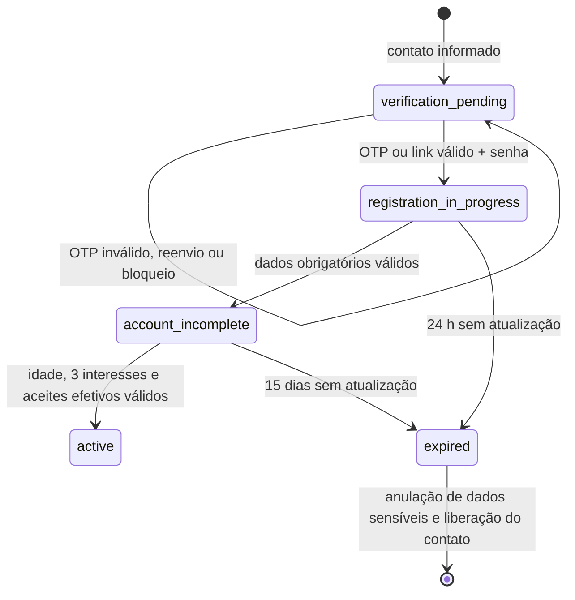
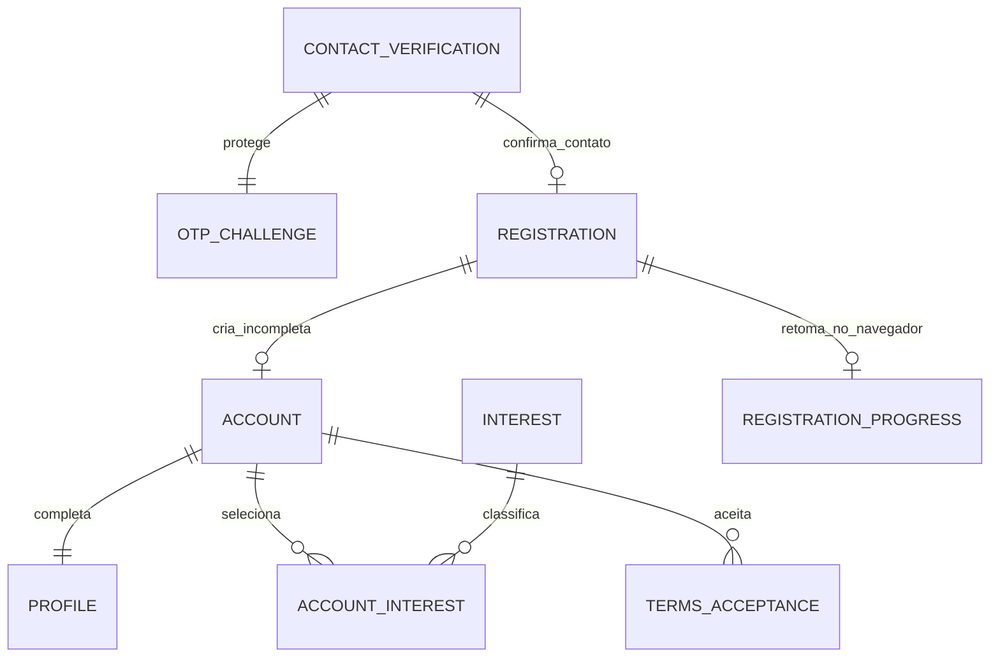

# 03 — Modelos de domínio e dados do EventMatch

## 1. Convenções

Este documento descreve o modelo conceitual derivado do DER v1.3. Não define tabelas nem schema físico. Drizzle ORM foi escolhido para os adapters PostgreSQL, mas entidades de domínio não são modelos Drizzle; adapters fazem o mapeamento. Identificadores são opacos e datas persistidas em UTC, com fuso explícito quando relevante ao evento.

Toda coleção sensível deve ter classificação, política de acesso, retenção e trilha de auditoria. Requisitos canônicos: [`DER-EventMatch-MVP.md`](DER-EventMatch-MVP.md).

## 2. Agregados principais

### 2.1 Account

Raiz da identidade de acesso.

- `accountId`, `status`, `birthDate` privado, `ageBand` derivada, `createdAt`.
- Contatos confirmáveis: e-mail e celular, cada qual único entre contas ativas.
- Credencial, sessões, versões de aceites e configuração “manter conectado”.
- Estados sugeridos: `pending_verification`, `active`, `age_verification`, `recovery_restricted`, `deactivation_pending`, `deactivated`, `deletion_pending`, `deleted`, `suspended`.
- Invariantes: maioridade; ao menos um contato confirmado; troca de senha invalida outras sessões; não remover único meio confirmado.

Referências: RF001–RF011, RF057–RF062, RF075–RF078, RF088–RF089; RN001–RN016, RN078–RN106, RN124–RN130.

#### Registration, ContactVerification e OtpChallenge

`Registration` é o agregado provisório do cadastro; não é uma `Account` parcialmente ativa. Ele nasce somente após a confirmação de contato e o registro de senha, e protege a retomada do fluxo sem conceder acesso ao produto.

- `Registration`: `registrationId`, `status`, contato confirmado de referência, credencial protegida, dados obrigatórios parciais, `lastUpdatedAt` e `expiresAt`.
- `ContactIdentifier`: value object de e-mail ou celular, normalizado e protegido; o valor completo não integra resposta pública, log ou progresso local.
- `ContactVerification`: desafio técnico associado ao identificador, canal e origem segura. É criado antes de `Registration` para evitar que uma conta provisória exista antes da confirmação.
- `OtpChallenge`: hash do OTP, expiração, número de tentativas, reenvios, bloqueio, chave de idempotência de entrega e correlação segura. O código em texto nunca é persistido.
- `TermsAcceptance`: registra somente aceite efetivo de documento aprovado, com tipo, versão imutável, idioma, vigência, instante, sujeito e contexto mínimo auditável. Uma apresentação lorem ipsum de teste nunca cria esse registro.
- `RegistrationProgress`: projeção local, versionada e de curta duração; contém apenas etapa, nome de exibição, cidade/região, intenção, interesses e campos opcionais aprovados. Nunca contém contato, nascimento, senha, OTP, tokens, aceites efetivos ou respostas do backend.

Estados do cadastro:

| Estado | Responsável | Permite | Bloqueia |
|---|---|---|---|
| `verification_pending` | `ContactVerification` | solicitar/reenviar e validar verificação | criação de `Registration` e acesso ao produto |
| `registration_in_progress` | `Registration` | salvar senha e dados obrigatórios | criação de `Account` sem dados obrigatórios |
| `account_incomplete` | `Account` | retomar exclusivamente o cadastro | eventos, perfil público, descoberta e demais recursos |
| `active` | `Account` | uso normal do produto | retorno ao fluxo de cadastro |
| `expired` | `Registration`/cleanup | reiniciar o fluxo | retomada com o registro expirado |

`account.birth_date` permanece nulo em `account_incomplete` e só é gravado na ativação, junto com aceites e interesses; nascimento de menor é recusado sem persistência. No schema físico, o `Registration` que origina a `Account` termina em `converted` (ADR-018), distinto de `expired`, que passa a significar somente abandono. Ambos anulam contato, cifra e hash de senha do registro.

O fluxo só avança; retornos de tela podem corrigir dados ainda não consolidados, mas não desfazem contato confirmado nem criam acesso fora do estado permitido. Para contato já associado, a resposta é neutra e inicia recuperação no mesmo canal, sem confirmar a existência da conta. A conclusão é uma transação única: revalida contato, senha, maioridade, dados obrigatórios, três interesses e aceites efetivos; ativa a `Account`, completa o `Profile`, associa interesses e grava aceites atomicamente.

O schema físico do cadastro está versionado pelas migrations `back/drizzle/0000_clever_epoch.sql`, `0001_seed_interests.sql` e `0002_registration_hardening.sql`: `registration` possui `contact_verification`, `verification_rate_window`, `registration`, `account`, `account_contact`, `account_credential`, `terms_document` e `terms_acceptance`; `profiles` possui `profile`, `profile_usage_intent` e `account_interest`; `catalog` possui `interest`. Contatos são índice cego HMAC + cifra AES-GCM, nunca texto claro. Índices parciais retêm contato apenas enquanto `registration_in_progress`, `account_incomplete` ou `active`; a expiração lazy anula dados sensíveis antes de liberar o contato. O seed `0001_seed_interests.sql` é idempotente e fixa os 20 interesses do DER §3.10. A `0002` (ADR-018) adiciona `registration.key_version`, o estado `converted`, o `CHECK registration_retained_data_check` (contato, cifra, versão de chave e hash de senha presentes se e somente se `registration_in_progress`), o `CHECK account_contact_holding_check` (`holds_contact` coerente com o contato) e torna anuláveis `account_credential.password_hash`, `profile.display_name` e `profile.region`, para que a expiração anule esses dados sem exclusão física da conta (ADR-017). A migration faz backfill de `key_version = 1` e reclassifica como `converted` registros já convertidos em conta.

### 2.2 Profile

- `profileId`, `accountId`, `displayName`, foto, apresentação, região aproximada e intenção.
- Interesses (mínimo três), campos opcionais e uma política de visibilidade por campo.
- Nascimento completo, e-mail e celular nunca integram a visão pública.
- Habilitação de anfitrião é capacidade derivada, não papel permanente.

Referências: RF004, RF006, RF012–RF016, RF081; RN004, RN008–RN014, RN018, RN112–RN114.

### 2.3 Event

- `eventId`, anfitrião atual, atividade, título, descrição, data/início, região, ponto exato protegido, capacidade e modalidade de entrada.
- Opcionais: imagem, término, custo estimado informativo, acessibilidade, alimentação, faixa etária, itens e orientações.
- Estados: `draft`, `published_open`, `full`, `cancelled`, `completed`, `not_held`.
- Histórico de alterações importantes e transferências.
- Invariantes: presencial, informal, gratuito, local público, capacidade >= confirmados, um anfitrião confirmado.

Referências: RF017–RF024, RF033–RF038, RF071, RF084–RF087; RN017–RN031, RN042–RN049, RN137.

### 2.4 ParticipationRequest e Participation

Separe intenção pendente de participação confirmada.

- `ParticipationRequest`: estado `pending|accepted|rejected|withdrawn|closed`, mensagem opcional, decisão/motivo protegido e contagem de tentativa.
- `Participation`: estado `confirmed|reconfirmation_pending|withdrawn|removed|age_verification|cancelled`, origem e reserva de vaga.
- `Attendance`: `attended|not_attended|uncertain`, realização do evento e eventual contestação.
- Operações de aceite, desistência, retirada e restauração devem atualizar a vaga atomicamente.

Referências: RF028–RF035, RF037–RF038, RF045–RF046, RF069–RF070, RF079, RF088–RF089, RF103, RF107; RN022–RN046, RN124–RN130, RN167–RN168.

### 2.5 EventConversation

- Uma conversa por evento; `Message`, `MessageAttachment`, `HostNotice`, `ModerationAction`, `Mute` e `ModerationAppeal`.
- A mensagem preserva autor, versão atual, original protegido quando moderada, datas e estado de visibilidade.
- Aviso pode ser comum ou essencial; no máximo um fixado.
- Controle de escrita/leitura deriva do evento e da participação, não apenas de um booleano local.

Referências: RF039–RF044, RF077, RF090, RF097, RF104; RN050–RN069, RN131–RN136, RN160–RN163.

### 2.6 Block

- Relação direcionada `blockerAccountId -> blockedAccountId`, estado e timestamps.
- A projeção de interação aplica efeitos recíprocos sem revelar quem bloqueou.
- Desbloqueio encerra a relação, mas não recria solicitações, conversas ou participações.

Referências: RF053–RF056, RF079; RN054–RN058, RN107, RN120.

### 2.7 ReportCase e SafetyRestriction

- `ReportCase`: protocolo, alvo polimórfico autorizado, categoria, relato, risco, status, anexos e responsável profissional.
- Status mínimos: `received`, `under_review`, `awaiting_information`, `completed`.
- `Appeal` e `EvidenceRequest` pertencem ao caso; anexos têm metadados, classificação e storage key, nunca URL pública.
- `SafetyRestriction`: tipo, motivo, responsável, início, duração/condição de término, escopo e contestação.
- Conflito de interesse impede atribuição/decisão pelo profissional envolvido.

Referências: RF049–RF052, RF057–RF058, RF065, RF072, RF076, RF080, RF091–RF097, RF106; RN075–RN084, RN089, RN097–RN110, RN138, RN150–RN155.

### 2.8 Review

- `Review`: autor confirmado, evento, respostas obrigatórias, campos opcionais, validade e flags de abuso/fraude.
- `ReviewAggregate`: projeção publicada somente com cinco autores válidos distintos.
- Comentário e respostas de segurança permanecem privados e não compõem ranking individual.

Referências: RF047–RF048, RF098–RF099; RN070–RN074, RN139–RN146.

### 2.9 Notification

- `Notification`: categoria, essencial/opcional, ocorrência, objeto afetado, ação, prazo, destino e estado de leitura.
- `NotificationPreference`: canais por categoria, preservando ao menos um canal para categorias essenciais.

Referências: RF063–RF064, RF094, RF105; RN088, RN164–RN166.

### 2.10 ProfessionalIdentity e AuditEntry

- Identidade profissional separada de perfil pessoal: nome de atendimento, e-mail corporativo único, função, equipe, status, entrada e identificador interno.
- Papéis: Atendimento, Analista de Confiança e Segurança, Responsável de Confiança e Segurança, Operação e Administrador autorizado.
- `CaseAssignment` registra escopo e declaração de conflito.
- `AuditEntry` é append-only: ator profissional, ação, alvo, contexto, instante, resultado e correlação; não replica conteúdo sensível desnecessário.

Referências: RF066–RF067, RF082–RF083, RF095–RF101; RN089–RN090, RN114, RN137–RN138, RN152–RN155.

### 2.11 Catalog

- `Catalog`, `CatalogOption`, ordem, estado ativo e intervalo de vigência.
- Referências históricas apontam para opção imutável/versionada; desativação não altera registros passados.
- Catálogos iniciais constam no DER §3.10.

### 2.12 DataRequest e RetentionHold

- `DataExportRequest`: autenticação reforçada, status, prazo de geração, expiração do download e artefato protegido.
- `DeletionRequest`: janela de cancelamento, etapas, anonimização e conclusão irreversível.
- `RecoveryCase` e `BirthDateCorrectionCase`: evidências protegidas, decisão, contestação e descarte.
- `RetentionPolicy`: categoria, base/finalidade, prazo e ação.
- `RetentionHold`: investigação, disputa ou ordem válida que suspende eliminação de itens específicos.

Referências: RF057–RF062, RF068, RF073–RF078; RN080–RN106, RN115–RN123.

## 3. Value objects e enums centrais

| Tipo | Valores/regras |
|---|---|
| `AgeBand` | `18_24`, `25_34`, `35_44`, `45_54`, `55_64`, `65_PLUS` |
| `EventStatus` | `DRAFT`, `PUBLISHED_OPEN`, `FULL`, `CANCELLED`, `COMPLETED`, `NOT_HELD` |
| `JoinMode` | `MANUAL_APPROVAL` (default), `AUTOMATIC` |
| `RequestStatus` | `PENDING`, `ACCEPTED`, `REJECTED`, `WITHDRAWN`, `CLOSED` |
| `ReportStatus` | `RECEIVED`, `UNDER_REVIEW`, `AWAITING_INFORMATION`, `COMPLETED` |
| `SafetyRating` | `VERY_UNSAFE`, `UNSAFE`, `NEUTRAL`, `SAFE`, `VERY_SAFE` |
| `Visibility` | `PRIVATE`, `APPROXIMATE`, `PARTICIPANTS`, `PUBLIC` conforme o campo |
| `ProtocolNumber` | identificador público não sequencial, sem vazar volume interno |

## 4. Integridade e concorrência

- Unicidade parcial para e-mail/celular confirmado em contas ativas.
- Aceite automático/manual e liberação de vaga usam transação e proteção contra corrida.
- Um pedido pendente por pessoa/evento; uma participação ativa por pessoa/evento.
- Capacidade nunca abaixo de confirmados; alteração e reconfirmação produzem histórico.
- Um aviso fixado por evento e um silenciamento de anfitrião de duas horas por reincidência prevista.
- Agregados de avaliação contam autores válidos distintos, nunca quantidade bruta de registros.
- Ações profissionais sensíveis e transições irreversíveis geram auditoria.
- OTP é válido por 15 minutos, permite cinco tentativas inválidas e bloqueia por 20 minutos após o limite; tentativas após a quinta falha não são contadas. Reenvio ocorre após 60 segundos, no máximo três vezes por desafio e por contato/hora, e sempre gera novo código (apenas o digest é armazenado), renovando a validade de 15 minutos. Há no máximo cinco desafios por contato/hora; o limite de dez por origem/IP/hora está adiado até existir origem confiável (ADR-015).
- Um novo pedido para o mesmo contato substitui o desafio aberto (`expired`), exceto se ele estiver bloqueado: nesse caso a resposta é neutra e nenhum desafio é criado até o fim do bloqueio.
- Criação de desafio, incremento de tentativa, confirmação de contato e conclusão do cadastro exigem atualização atômica/locking. Chaves de idempotência são por desafio e entrega.
- `Registration` expira 24 horas após a última atualização; `Account` incompleta expira após 15 dias sem atualização. A expiração é lazy (no próximo pedido ou passo do mesmo contato/cadastro) ou pelo caso de uso em lote não agendado; em ambos os casos anula contato, cifra, credencial, nascimento, nome, região, intenções e interesses, mantendo apenas a linha de auditoria mínima, e libera o contato (ADR-017).
- Violações de unicidade (`23505`) são traduzidas nos adapters para `RegistrationError('CONTACT_UNAVAILABLE')`; o pedido de verificação converte esse erro em resposta neutra. IDs malformados são tratados como inexistentes, sem abortar a transação.

## 5. Classificação de dados

| Classe | Exemplos | Acesso |
|---|---|---|
| Público | nome de exibição, foto pública, região aproximada, dados públicos do evento | visitante conforme regras |
| Privado de conta | e-mail, celular, nascimento, sessões | titular e fluxos autorizados |
| Compartilhado no evento | ponto exato, participantes confirmados, conversa | participantes autorizados |
| Sensível operacional | denúncias, anexos, evidências, documentos, mensagem original moderada | profissional autorizado por caso |
| Interno | motivos internos, sinais de risco, auditoria, permissões | papéis específicos e menor privilégio |

## 6. Retenção e ressalva jurídica

Implemente retenção por categoria conforme `docs/02-regras-de-negocio.md §9`, com eliminação verificável, anonimização quando prevista e legal hold granular. RF068, RF073, RF074, RN068, RN080–RN083, RN093, RN096, RN100–RN104, RN115–RN122 e RNF023 não podem ter política final liberada sem validação jurídica brasileira.
